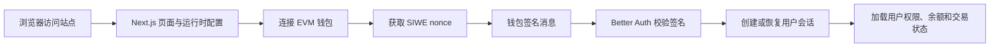
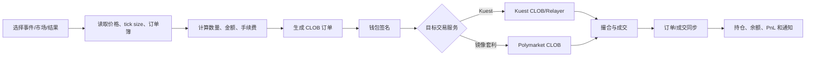
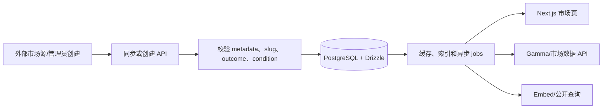
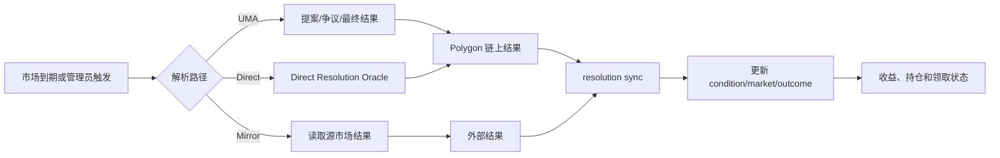
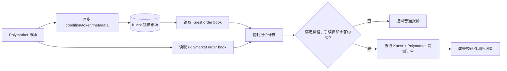

# Kuest Prediction Market 项目分析与 Polymarket 差异评估

> 分析基于当前仓库代码、配置、数据库 schema、API 文档和 README。本文关注功能与架构，不把 Kuest 与 Polymarket 做逐文件源码 diff。

## 1. 项目定位与总体结论

Kuest 是一个可白标部署的预测市场基础设施。它提供市场展示、钱包认证、CLOB 交易、市场创建、结果结算、运营后台、联盟分成和多种部署方式，运营方可以使用自己的域名、品牌和手续费配置。

项目的核心特征是“Polymarket 兼容 + 平台化扩展”：交易数据结构和订单接口大量采用 Polymarket CLOB 习惯，同时增加 Polymarket 市场镜像、共享流动性、跨平台套利、运营方隔离和企业部署能力。因此它不是单纯的 Polymarket 前端，也不是只有智能合约的 Demo，而是一个包含前台、API、数据库、同步任务和基础设施的完整应用层。

从当前代码看，核心交易与结算能力已经具备，但 README 仍将撮合引擎迁移到主网、压力测试和金融一致性检查列为进行中事项；部署前仍应把资金安全、链上状态一致性、订单幂等和高并发测试作为重点。

## 2. 技术栈与项目结构

### 2.1 技术栈

| 层次 | 技术/组件 | 作用 |
|---|---|---|
| Web 应用 | Next.js 16、React 19、TypeScript | 页面、Server Components、API Route Handler 和 SSR |
| UI | Tailwind CSS、Base UI、Lucide、FullCalendar、Visx | 交易界面、图表、后台和体育日历 |
| 数据库 | PostgreSQL、Drizzle ORM、`postgres` | 业务持久化、事务、索引和 schema 管理 |
| 身份认证 | Better Auth、SIWE、Reown AppKit、wagmi/viem | 钱包登录、会话和链上签名 |
| 区块链 | Polygon、USDC、CTF、UMA、NegRisk、Relayer | 条件代币、抵押物、结算和交易执行 |
| 交易 | CLOB、WebSocket、Polymarket CLOB Client | 订单簿、下单、撤单、报价和成交 |
| 存储 | Supabase Storage 或 S3 兼容存储 | 图片和其他对象文件 |
| 运维 | Sentry、Vercel Cron、Terraform、Docker/云平台 | 监控、同步任务和多环境部署 |

### 2.2 顶层目录

- `src/app`：Next.js 页面、布局、管理后台、文档页和 API 路由。
- `src/components`：通用 UI、交易组件、市场卡片、后台组件和嵌入组件。
- `src/lib`：认证、钱包、CLOB、市场查询、结算、同步、套利、存储和业务服务。
- `src/lib/db/schema`：Drizzle PostgreSQL schema，按 auth、events、orders、affiliates 等领域拆分。
- `src/stores`：用户、订单、通知、钱包和 UI 偏好等客户端状态。
- `src/providers`：AppKit、运行时配置、站点身份和全局 Provider。
- `scripts`：事件、结算、体育比分、翻译、成交量和市场创建同步脚本。
- `tests/unit`、`tests/e2e`：Vitest 单元测试和 Playwright 端到端测试。
- `docs/api-reference`：Gamma/市场数据、CLOB、Relayer、WebSocket 和创建市场 API 文档。
- `infra/terraform`：Cloud Run、Railway、Fly.io、Kubernetes、GKE 和 DigitalOcean 部署模块。

## 3. 功能模块与代码逻辑

### 3.1 用户、钱包和权限

用户先通过 EVM 钱包连接，然后使用 SIWE nonce 签名证明地址控制权；Better Auth 创建和维护用户、账户、会话和钱包关系。交易所需的签名仍由钱包完成，应用服务器保存的是会话、认证凭证和订单状态，而不是用户私钥。

相关入口包括 `src/lib/auth.ts`、`src/app/api/auth/[...all]/route.ts`、`src/app/api/siwe` 和 `src/lib/wallet.ts`。Sumsub 模块提供 KYC 状态和 webhook，geoblock 模块执行国家/地区限制。

### 3.2 事件、市场和结果

数据采用“事件 Event → 市场 Market → 结果 Outcome”的层级。一个事件可以包含多个问题市场；市场通过 `condition_id` 关联链上条件，通过 outcomes 关联 YES/NO 或多结果 token。

市场同步服务会清洗标题、slug、metadata、结果 token、NegRisk 字段、结算信息和 Polymarket 镜像信息，并用事务更新相关表。管理员创建市场则先进入 `event_creations` 草稿/待部署状态，再由签名者、链上交易和同步任务完成发布。

### 3.3 CLOB 交易

典型下单链路是：

1. 前端读取市场信息、tick size、价格和订单簿。
2. 根据 token id、价格、数量、方向和订单类型组装订单。
3. 钱包对订单签名，得到包含 maker、signer、nonce、金额、过期时间、费率和 signature 的订单。
4. 订单提交至 CLOB/Relayer，撮合后产生成交和账户状态。
5. Kuest 保存订单索引和外部 CLOB order id，并通过开放订单、成交、持仓和同步接口展示结果。

`src/lib/db/schema/orders/tables.ts` 保存链上订单字段和 Kuest 用户关联；`src/lib/clob.ts`、`src/lib/clob-open-orders.ts`、`src/lib/polymarket-orders-client.ts` 分别承担 CLOB 配置、开放订单和 Polymarket 兼容下单逻辑。订单撮合不是完全在 PostgreSQL 中完成，也不是逐笔直接写入链上，而是由 CLOB/撮合服务和链上结算共同完成。

### 3.4 Polymarket 镜像和套利

`markets.polymarket_condition_id`、`outcomes.polymarket_token_id` 和 `events.is_polymarket_mirror` 建立本地市场与 Polymarket 市场的映射。同步任务获取 Polymarket 元数据和 token id，交易时可以同时读取 Kuest 与 Polymarket 两侧 order book。

套利模块计算两侧价格、手续费、余额和可成交数量，在满足成本约束时生成 Kuest 订单和 Polymarket FOK 订单。`src/app/api/arbitrage/polymarket-order/route.ts` 还会校验签名请求、owner、signer 和镜像 token，降低把订单发到错误市场的风险。

### 3.5 结算与收益

结算路径由市场的 oracle、metadata 和 NegRisk 配置决定：

- UMA/Legacy：使用 UMA 请求、提案、争议和最终结果。
- Direct Resolution：通过直接解析 oracle/adapter 提交 YES、NO 或 UNKNOWN。
- NegRisk：使用 NegRisk operator 和对应 adapter 处理多市场互斥结果。
- Mirror Resolution：镜像市场根据 Polymarket/Chainlink/UMA 的源结果同步本地状态。

`conditions` 表记录 oracle、question id、请求交易、resolution status、价格、争议和 deadline；`src/app/api/sync/resolution/route.ts` 与 `src/lib/resolution-payout-sync.ts` 负责把链上/外部结果同步到数据库并推动收益展示和领取。

### 3.6 运营与扩展功能

系统还包含管理员市场管理、联盟/affiliate 手续费、排行榜和 PnL、通知、评论与回复、收藏、AI 市场上下文、翻译、体育比分、嵌入式市场、Li.Fi 跨链充值/兑换和站点主题/多语言配置。这些能力使 Kuest 更接近运营平台，而不是只提供交易页。

## 4. 程序流程图

### 4.1 用户访问与钱包登录

### 4.2 下单与成交

### 4.3 市场同步与展示

### 4.4 结算

### 4.5 Polymarket 镜像与套利

## 5. 数据存储与一致性边界

### 5.1 PostgreSQL/Drizzle 数据域

| 数据域 | 主要表/字段 | 作用 |
|---|---|---|
| 用户认证 | `users`、`accounts`、`sessions`、`wallets`、`two_factors` | 用户身份、钱包和会话 |
| 市场 | `conditions`、`events`、`markets`、`outcomes` | 问题、事件、条件和结果 token |
| 分类扩展 | `tags`、`event_tags`、`event_translations`、sports 表 | 分类、翻译和体育信息 |
| 订单 | `orders` | CLOB 订单原文、用户、condition 和外部 order id |
| 结算 | `conditions` 中的 oracle/resolution 字段、审计字段 | UMA、Direct、NegRisk 和争议状态 |
| 运营 | affiliate、notifications、bookmarks、settings | 分成、通知、收藏和站点配置 |
| 异步任务 | `jobs`、`event_creations` | 去重、重试、定时同步和市场发布 |
| KYC | `sumsub_applicants`、webhook 和限流表 | 身份验证状态和回调审计 |

### 5.2 链上、链下和对象存储边界

- PostgreSQL 保存可查询的业务投影、订单索引、市场 metadata、同步状态和运营数据。
- Polygon 保存 USDC、条件代币、订单执行/结算交易、oracle 状态和最终资产状态。
- CLOB/Relayer 保存或处理订单簿、签名校验、撮合和交易广播；数据库中的订单记录不能单独视为链上最终状态。
- Supabase Storage 或 S3 保存图片等对象，数据库只保存 URL/元数据。
- 外部 Polymarket、UMA、体育数据和价格数据经过 API/cron/job 同步后进入缓存或本地投影。

因此，资金相关功能必须以链上确认和可重放同步为最终依据；数据库更新应具备幂等键、重试和审计记录。

## 6. 与 Polymarket 的差异评估

### 6.1 功能与架构差异矩阵

| 维度 | Polymarket 典型形态 | Kuest 当前实现 | 差异程度 |
|---|---|---|---|
| 产品定位 | 单一品牌预测市场 | 可白标、多运营方基础设施 | 高 |
| 市场来源 | 自营创建和管理 | 自建 + Polymarket 镜像 + 运营方市场 | 高 |
| 流动性 | 自身 CLOB 为主 | Kuest CLOB + 共享流动性 + 外部套利 | 高 |
| 交易协议 | CLOB、L1/L2 签名和 Relayer | 兼容其订单思想，同时扩展 Kuest 认证、费率和 affiliate | 中高 |
| 结算 | CTF/UMA/NegRisk 体系 | 兼容 UMA/NegRisk，并增加 Direct/Mirror resolution | 中高 |
| 数据模型 | 市场、事件、用户和交易数据 | 增加镜像映射、运营方、jobs、sports、KYC、翻译和 affiliate | 高 |
| 运营能力 | Polymarket 自营后台和品牌 | 多站点主题、域名、管理员、嵌入、联盟分成 | 高 |
| 身份与合规 | 由 Polymarket 统一运营 | 可配置 KYC、地域限制和站点策略 | 中高 |
| 部署 | 统一中心化服务 | Vercel、Supabase、云平台和 Kubernetes 多种部署 | 高 |
| API/SDK | Polymarket 公开 Gamma/CLOB/Data API | 提供兼容风格 API，同时增加站点隔离和镜像能力 | 中高 |

### 6.2 数量化结论

按功能域统计，Kuest 与 Polymarket 有约 **8 个主要共同能力域**：预测市场、条件 token、Polygon、USDC、CLOB、订单签名、UMA/NegRisk 结算、市场/结果查询。

按当前代码可确认的显著新增或改造能力统计，至少有 **12 个能力域**：

1. 白标品牌和多站点配置。
2. 共享流动性。
3. Polymarket 市场镜像。
4. 跨平台套利。
5. 运营方手续费。
6. Affiliate/链上费用分成。
7. 市场创建草稿、部署和递归创建。
8. 体育、加密、Nasdaq 和社区市场扩展。
9. KYC/Sumsub 和地域限制。
10. 嵌入式市场和公开站点 API。
11. 多语言、主题和自定义 JavaScript/品牌配置。
12. 多云部署、异步 jobs 和同步任务体系。

这不是“功能数量百分比”，因为 Polymarket 的内部实现并未完整包含在本仓库中。更准确的判断是：Kuest 在核心交易协议和链上条件市场模型上与 Polymarket 高度兼容或借鉴其设计；在产品定位、数据模型、运营层、镜像流动性、套利和部署层存在明显扩展。因此整体差异属于“核心交易相似，平台化能力显著不同”，而不是 Polymarket 的简单前端复制。

## 7. 风险与后续检查重点

- README 已将主网撮合迁移、压力测试和金融一致性列为未完成事项，生产环境应优先验证。
- 订单、成交、链上余额和数据库投影之间需要端到端对账与幂等测试。
- 镜像套利涉及双边执行，需处理一侧成功、一侧失败、价格滑移、余额变化和重复提交。
- 结算路径较多，应分别覆盖 UMA 争议、Direct、NegRisk、Mirror 和未知结果。
- CLOB、Relayer、UMA、Polymarket 和体育数据均是外部依赖，需要超时、重试、限流和降级策略。
- KYC、地域限制、运营方隔离和 affiliate 费用属于合规/财务敏感逻辑，应保留审计日志并进行权限测试。

## 8. 主要代码依据

- `package.json`：运行时、Web3、数据库和测试依赖。
- `README.md`：产品定位、支持能力和 roadmap。
- `src/lib/db/schema/events/tables.ts`：事件、市场、条件、结果、体育和任务表。
- `src/lib/db/schema/orders/tables.ts`：CLOB 订单持久化结构。
- `src/lib/auth.ts`、`src/lib/wallet.ts`：认证和钱包流程。
- `src/lib/clob.ts`、`src/lib/polymarket-orders-client.ts`：CLOB 和 Polymarket 订单逻辑。
- `src/lib/direct-resolution.ts`、`src/lib/mirror-resolution.ts`：结算分支。
- `src/app/api/sync/*`：事件、结算、成交量、翻译、体育和市场创建同步。
- `src/app/api/arbitrage/*`、`src/lib/arbitrage-quote.ts`：跨平台套利。
- `docs/api-reference`：公开 API、CLOB、Relayer 和 WebSocket 接口说明。
- `infra/terraform`：多云和 Kubernetes 部署定义。
