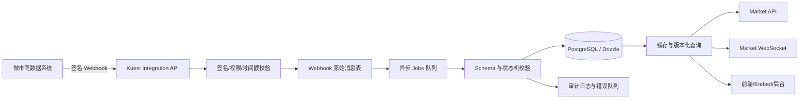
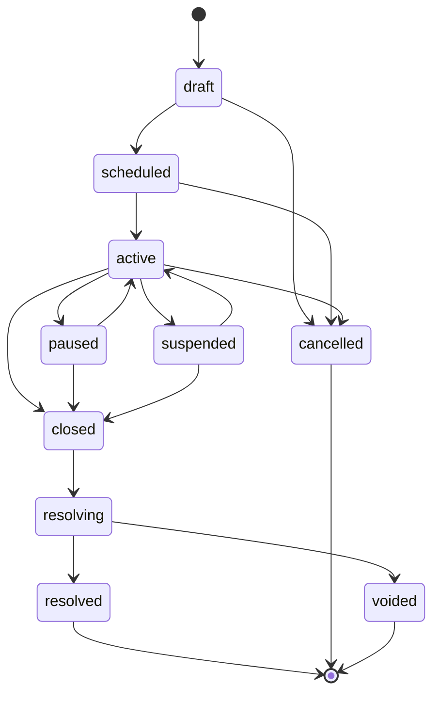

# 做市商市场基础数据接入规范

**文档状态：** Production Draft  
**版本：** v1.0  
**适用系统：** Kuest Prediction Market  
**接入方式：** 做市商主动 Webhook + Kuest 定时快照校准  
**更新时间：** 2026-08-04

## 1. 文档目标

本文定义做市商向 Kuest 提供市场基础数据和市场状态的生产接入协议，明确：

- 做市商需要提供哪些数据；
- 数据如何推送、鉴权、幂等、重试和校准；
- 状态类数据如何处理；
- 订单、资金和持仓由谁负责；
- Kuest 如何将外部数据转换为内部事件、市场、结果和结算模型。

本规范的默认责任边界是：

> 做市商提供市场数据和状态；Kuest 负责用户、订单、成交、资金、持仓、结算和最终账务。

## 2. 系统责任边界

| 数据或动作 | 做市商 | Kuest | 最终权威 |
|---|---|---|---|
| 事件和市场定义 | 提供 | 校验、标准化、存储、发布 | Kuest 标准化模型 |
| Outcome 定义 | 提供 | 校验 token/condition 映射 | Kuest + 链上数据 |
| 市场开闭、暂停状态 | 提供建议/事件 | 校验状态机并执行交易限制 | Kuest 状态机 |
| 结果来源和解析规则 | 提供 | 保存并配置解析流程 | Kuest 配置的 oracle |
| 最终结算结果 | 可提供建议 | 通过 UMA/Direct/NegRisk 等流程确认 | 链上 oracle/Kuest 结算流程 |
| 用户订单 | 不提供 | 接收、签名校验、撮合、撤单 | Kuest CLOB/Relayer |
| 用户成交 | 不提供 | 记录和同步 | Kuest CLOB/链上状态 |
| 用户资金 | 不提供 | 查询链上并生成账务投影 | Polygon 链上状态 |
| 用户持仓 | 不提供 | 根据成交、token balance 和结算计算 | Kuest + Polygon |
| 做市商自有库存 | 可选提供 | 作为风控和流动性参考 | 做市商钱包/链上状态 |

做市商不得通过市场数据接口修改用户订单、用户余额、用户持仓或用户结算金额。

## 3. 接入架构



### 3.1 数据流原则

1. Webhook 接口只负责快速鉴权、校验基础格式、落原始消息和返回 ACK。
2. 业务更新通过异步 job 执行，避免做市商请求被数据库或外部服务阻塞。
3. 所有外部 ID 必须与 `maker_id` 组合使用，不能假设不同做市商的 ID 全局唯一。
4. 外部数据先转换为 Kuest 内部模型，再提供给前端和公开 API。
5. 链上状态、订单成交和用户资产不接受做市商数据覆盖。

## 4. 做市商需要提供的数据

### 4.1 Event 事件

| 字段 | 类型 | 必填 | 说明 |
|---|---|---:|---|
| `external_event_id` | string | 是 | 做市商侧事件 ID |
| `title` | string | 是 | 事件标题 |
| `description` | string | 否 | 事件描述 |
| `rules` | string | 否 | 事件规则 |
| `category` | string | 否 | 主分类 |
| `tags` | string[] | 否 | 标签列表 |
| `start_time` | datetime | 否 | 事件开始时间，UTC |
| `end_time` | datetime | 否 | 事件结束时间，UTC |
| `status` | enum | 是 | 事件状态 |
| `resolution_source` | string | 否 | 结果来源名称 |
| `resolution_source_url` | string | 否 | 结果来源地址 |
| `language` | string | 否 | BCP-47 语言代码 |
| `metadata` | object | 否 | 扩展字段 |
| `version` | integer | 是 | 做市商侧单调递增版本 |
| `updated_at` | datetime | 是 | 数据更新时间，UTC |

### 4.2 Market 市场

| 字段 | 类型 | 必填 | 说明 |
|---|---|---:|---|
| `external_market_id` | string | 是 | 做市商侧市场 ID |
| `external_event_id` | string | 是 | 所属事件 ID |
| `question` | string | 是 | 市场问题 |
| `slug` | string | 否 | 外部 slug，Kuest 会生成内部 slug |
| `market_type` | enum | 是 | `binary`、`categorical` 等 |
| `currency` | string | 是 | 默认 `USDC` |
| `chain_id` | integer | 否 | 链 ID，Polygon 主网为 `137` |
| `condition_id` | hex string | 否 | 已部署的链上 condition ID |
| `neg_risk` | boolean | 否 | 是否为 NegRisk 市场 |
| `accepting_orders` | boolean | 是 | 是否接受新订单 |
| `market_status` | enum | 是 | 市场状态机状态 |
| `open_time` | datetime | 否 | 开市时间 |
| `close_time` | datetime | 否 | 关市时间 |
| `resolution_time` | datetime | 否 | 预计解析时间 |
| `resolution_source` | string | 否 | 结果来源 |
| `resolution_rules` | string | 否 | 解析规则 |
| `metadata` | object | 否 | 扩展字段 |
| `version` | integer | 是 | 单调递增版本 |
| `updated_at` | datetime | 是 | 数据更新时间，UTC |

### 4.3 Outcome 结果项

| 字段 | 类型 | 必填 | 说明 |
|---|---|---:|---|
| `external_outcome_id` | string | 是 | 外部结果 ID |
| `external_market_id` | string | 是 | 所属市场 |
| `outcome_index` | integer | 是 | 稳定的结果顺序，从 0 开始 |
| `label` | string | 是 | 展示名称，如 `Yes`、`No` |
| `token_id` | string | 否 | 已部署的条件 token ID |
| `status` | enum | 是 | `active`、`disabled`、`resolved` 等 |
| `display_order` | integer | 否 | 展示顺序 |
| `metadata` | object | 否 | 扩展字段 |

### 4.4 结果来源和解析信息

做市商可提供以下信息：

- 结果来源名称、URL 和来源 ID；
- 解析规则和关键时间点；
- 当前结果候选；
- 结果来源的原始证据 URL 或快照；
- 预计解析时间；
- 结果版本、置信状态和更新时间。

结果候选必须标记为 `provisional`，不能直接改变用户可领取金额。Kuest 必须通过配置的 UMA、Direct Resolution、NegRisk 或其他权威 oracle 完成最终结算。

## 5. 状态模型

### 5.1 标准状态

事件和市场统一支持以下状态：

```text
draft
scheduled
active
paused
suspended
closed
resolving
resolved
cancelled
voided
```

### 5.2 推荐状态转换



### 5.3 状态事件格式

```json
{
  "event_id": "mm_01JSTATUS001",
  "event_type": "market.status_changed",
  "schema_version": "1.0",
  "maker_id": "maker_001",
  "occurred_at": "2026-08-04T10:00:00Z",
  "sequence": 1024,
  "entity_type": "market",
  "entity_id": "external-market-123",
  "previous_status": "active",
  "status": "paused",
  "reason": "source_temporarily_unavailable",
  "effective_at": "2026-08-04T10:00:00Z",
  "version": 7,
  "idempotency_key": "maker_001:market.status_changed:external-market-123:7",
  "payload": {
    "accepting_orders": false
  }
}
```

### 5.4 状态处理规则

- `paused`、`suspended`：禁止新订单；已有订单按市场配置撤销或保持可成交。
- `closed`：禁止新订单，等待结算流程。
- `resolving`：禁止交易，等待权威 oracle 结果。
- `resolved`：禁止交易，进入收益/领取流程。
- `cancelled`、`voided`：禁止交易，按平台规则处理退款或无效化。
- 已进入 `resolved`、`cancelled` 或 `voided` 的市场不可由做市商回退状态。
- 做市商状态与链上状态冲突时，链上状态和 Kuest 风控状态优先。
- 每次状态改变必须记录旧状态、新状态、原因、来源、版本和处理时间。

## 6. Webhook 接口

### 6.1 接口清单

```text
POST /api/integrations/market-makers/v1/events/upsert
POST /api/integrations/market-makers/v1/markets/upsert
POST /api/integrations/market-makers/v1/outcomes/upsert
POST /api/integrations/market-makers/v1/status
POST /api/integrations/market-makers/v1/resolution-source
POST /api/integrations/market-makers/v1/snapshot
GET  /api/integrations/market-makers/v1/health
GET  /api/integrations/market-makers/v1/ack/{event_id}
```

建议将这些接口作为内部 integration API，不与用户 CLOB API 混用。

### 6.2 通用消息封装

```json
{
  "event_id": "mm_01J...",
  "event_type": "market.updated",
  "schema_version": "1.0",
  "maker_id": "maker_001",
  "occurred_at": "2026-08-04T10:00:00Z",
  "sequence": 1024,
  "entity_type": "market",
  "entity_id": "external-market-123",
  "version": 8,
  "idempotency_key": "maker_001:market.updated:external-market-123:8",
  "payload": {}
}
```

### 6.3 HTTP 返回码

| HTTP 状态 | 含义 | 做市商处理 |
|---:|---|---|
| `200` | 已处理或重复消息已安全忽略 | 不重试 |
| `202` | 已接收，异步处理 | 不重试，等待状态查询 |
| `400` | JSON 或通用字段错误 | 修正后重试 |
| `401` | 签名或认证失败 | 不重复重试，检查凭证 |
| `403` | 无权限访问该 maker/市场 | 联系平台确认权限 |
| `409` | 版本冲突或状态冲突 | 拉取快照后重试 |
| `422` | 业务字段校验失败 | 修正数据后重试 |
| `429` | 超过限流 | 按 `Retry-After` 重试 |
| `500/503` | Kuest 暂时不可用 | 指数退避重试 |

## 7. 认证、安全与幂等

### 7.1 请求头

```text
X-Maker-Id: maker_001
X-Request-Id: req_01J...
X-Timestamp: 1785837600
X-Signature: sha256=...
X-Schema-Version: 1.0
```

### 7.2 HMAC 签名

签名原文：

```text
HTTP_METHOD + "\n" +
PATH + "\n" +
X-Timestamp + "\n" +
X-Request-Id + "\n" +
SHA256(REQUEST_BODY)
```

签名算法：`HMAC-SHA256`。服务端必须执行：

- 时间戳窗口校验，建议不超过 ±300 秒；
- `X-Request-Id` 重放检测；
- 常量时间比较签名；
- `maker_id` 与 API key 权限匹配；
- body 大小和字段白名单校验。

### 7.3 幂等和版本

- `event_id` 是消息唯一 ID。
- `idempotency_key` 是业务幂等键。
- 同一幂等键重复提交必须返回原处理结果。
- 同一实体的 `version` 必须单调递增。
- 低版本更新不得覆盖高版本数据。
- 同版本内容不同必须进入冲突队列，不应静默覆盖。
- `sequence` 用于发现丢消息和乱序，不能替代实体版本。

## 8. 快照、重试和故障恢复

### 8.1 快照

做市商应提供全量或增量快照，建议每小时一次，至少每日一次。快照包含：

- maker 当前数据版本；
- 最后 sequence；
- 事件、市场和 outcome 当前状态；
- 生成时间；
- 数据范围和 checksum；
- 被删除或失效实体列表。

快照用于补偿丢失 Webhook、修复乱序、发现数据漂移和执行双边对账。

### 8.2 重试策略

建议使用指数退避：

```text
第 1 次：1 秒
第 2 次：5 秒
第 3 次：30 秒
第 4 次：5 分钟
第 5 次：30 分钟
```

超过最大重试次数后，做市商应停止自动重试并告警；Kuest 将消息标记为 `failed`，由运营人员或快照任务处理。

### 8.3 数据过期

每条数据保存：

- `received_at`
- `occurred_at`
- `updated_at`
- `source_status`
- `stale_at`

超过数据有效期后，前端和后台应显示“数据可能已过期”，交易风控可根据市场类型自动暂停新订单。

## 9. 订单、资金和持仓设计

### 9.1 用户订单

用户订单不需要由做市商提供。用户订单链路保持：

```text
用户钱包签名
  → Kuest CLOB API
  → CLOB/Relayer
  → 撮合
  → Kuest 订单与成交同步
  → 用户持仓和余额投影
```

Kuest 负责：

- 下单、撤单和批量订单；
- 订单签名校验；
- 订单状态和成交状态；
- 订单簿和 WebSocket 推送；
- 用户账户、交易历史、持仓和 PnL。

### 9.2 做市商报价

如果未来需要做市商提供报价，应作为独立的报价/流动性接口，不得伪装成用户订单。可选字段包括：

- `maker_quote_id`
- `market_id`
- `outcome_id`
- `side`
- `price`
- `size`
- `expires_at`
- `max_inventory`
- `quote_version`
- `maker_order_reference`

平台应将报价转换为受 Kuest 风控控制的订单，或由做市商使用自己的签名账户通过 CLOB 下单。

### 9.3 用户资金

用户资金应以 Polygon 链上余额、USDC allowance、条件 token balance 和结算交易为准。做市商不需要提供用户资金数据。

做市商可以提供自己的资金快照用于风控：

- 做市商钱包地址；
- USDC 可用余额；
- token 库存；
- allowance；
- 单市场或全局风险限额；
- 余额告警状态。

这些数据只能用于判断做市商是否有能力继续报价，不能覆盖 Kuest 用户账本。

### 9.4 用户持仓

用户持仓由 Kuest 根据以下来源计算：

- Kuest 成交记录；
- Polygon conditional token balance；
- 结算结果；
- 赎回/领取交易；
- 账户资金变动。

做市商不应提供普通用户持仓。做市商自身库存可以单独记录为 `maker_inventory_snapshots`，与用户 `positions` 完全隔离。

## 10. Kuest 侧实现清单

### 10.1 数据表

建议新增：

- `market_maker_integrations`：做市商、权限、密钥版本、状态和限流配置。
- `market_maker_webhook_events`：原始 payload、签名、处理状态、错误和重试信息。
- `market_maker_event_cursors`：每个 maker 的 sequence、快照版本和同步时间。
- `market_maker_snapshots`：快照元数据、checksum、范围和校验结果。
- `market_maker_status_audit`：状态前后值、原因、来源和处理人。
- `market_maker_market_mappings`：外部 event/market/outcome 与 Kuest ID 的映射。
- `market_maker_inventory_snapshots`：可选，仅保存做市商自身库存。

现有 `events`、`markets`、`outcomes`、`conditions` 继续作为 Kuest 标准模型；外部 ID、maker ID、版本和来源应使用显式字段或关联表，不应全部塞入 metadata。

### 10.2 处理服务

```text
Integration API
  → authentication
  → raw webhook persistence
  → idempotency check
  → job enqueue
  → payload validation
  → entity mapping
  → version check
  → state transition check
  → transaction update
  → cache invalidation
  → WebSocket broadcast
  → audit record
```

实现应复用仓库现有的 Drizzle、`jobs`、同步路由、CLOB/WebSocket 和缓存失效机制。

## 11. 验收标准

### 功能验收

- 能创建/更新 Event、Market、Outcome，并完成外部 ID 映射。
- 能接收状态变更并执行合法状态转换。
- 市场暂停后新订单被阻止，已有订单按配置处理。
- 结果来源和解析信息可以被后台查看和审计。
- 市场数据可以通过现有 Market API 和 WebSocket 提供给前端。
- 快照能发现和修复遗漏的 Webhook。

### 安全验收

- 无效签名、过期请求、重放请求被拒绝。
- maker 只能访问授权的市场范围。
- 做市商不能修改用户订单、余额、持仓和结算金额。
- 密钥轮换不影响历史消息审计。
- payload 大小、字段、速率和权限均受限制。

### 一致性验收

- 重复消息不会重复写入或重复创建市场。
- 低版本消息不会覆盖高版本数据。
- 同版本冲突会进入人工处理队列。
- 链上状态优先于做市商状态。
- 用户持仓与链上 token balance、成交记录能够对账。
- 做市商库存不会混入用户持仓。

### 可运维性验收

- 可查看 webhook 接收、处理、失败和重试状态。
- 可按 maker、entity、event_id 和 request_id 查询审计记录。
- 可监控 webhook 延迟、错误率、数据新鲜度和快照校验结果。
- 做市商 feed 异常时有告警和降级策略。

## 12. 推荐实施顺序

1. 建立 maker integration 配置、签名认证和 webhook 原始消息表。
2. 实现 Event、Market、Outcome 的 upsert 和外部 ID 映射。
3. 实现市场状态事件、状态机和审计记录。
4. 接入 jobs 异步处理、幂等、重试和失败队列。
5. 接入 Market API/WebSocket 的状态广播和缓存失效。
6. 实现全量快照和增量校准。
7. 增加结果来源和 provisional resolution 数据，但不直接改写结算结果。
8. 最后再评估做市商报价、库存和资金限额接口。

## 13. 结论

第一阶段做市商只需要提供：

1. Event 基础资料；
2. Market 基础资料；
3. Outcome 基础资料；
4. 市场开闭、暂停、恢复和取消状态；
5. 结果来源、解析规则和结果候选；
6. 定期全量快照用于校准。

订单、资金和用户持仓不需要由做市商提供。它们应分别由 Kuest CLOB/Relayer、Polygon 链上状态和 Kuest 成交/结算逻辑维护。只有做市商自身的报价、库存、余额和风险限额可以作为可选风控数据独立接入。
